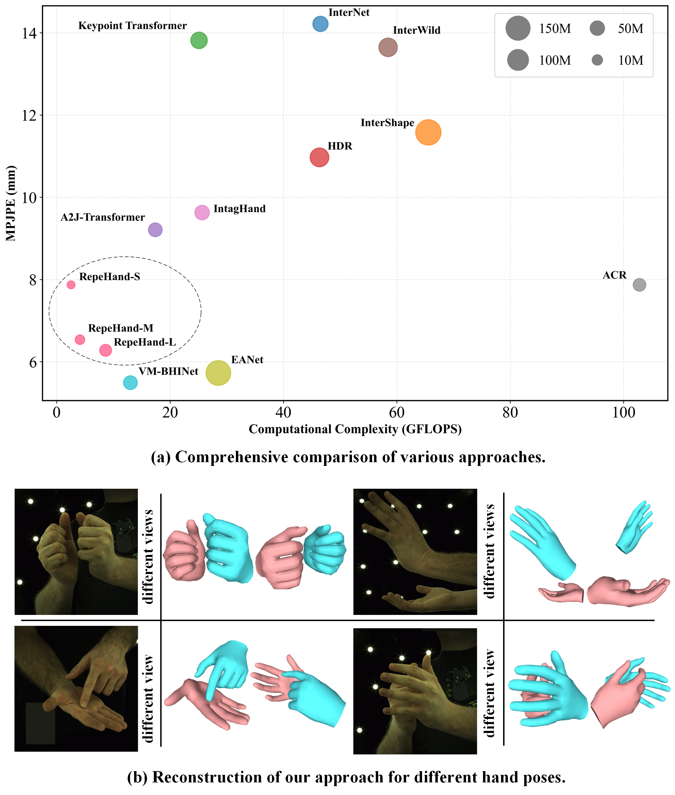

# RepeHand

## This repository is an official implementation of the paper  "RepeHand: Lightweight 3D Two-Hand Reconstruction with Perception Enhancement
from Monocular Image".

### Abstract
Reconstructing two interacting hands from a monocular image on resource-limited
platforms presents significant challenges when balancing reconstruction performance
and computation efficiency. To address this problem, we introduce RepeHand, a
lightweight framework for 3D two-hand mesh recovery that achieves high
reconstruction accuracy under low computation cost. To capture hand visual features
and spatial interaction information, we design an Interactive Hand Perception
Enhancement (IHPE) to acquire feature maps from multiple dimensions via perception
enhancement technology, which enriches the hand cues by combining spatial,
channel, and pixel attentions. Additionally, an Adaptive Feature Enhancement (AFE)
sub-module is integrated to refine hand joint features by adapting an enhanced
attention for improving hand reconstruction representation. Furthermore, we design a
hand mesh regression function (MeshReg) that includes two modules: JointLocalizer
and JointFeatureSampler, which are designed to localize hand joint and sample joint-oriented cues through different integrations with hand feature maps for more accurate
predictions of hand pose and shape. Overall, our framework achieves the state-of-the-art balance with miniature 6.99M parameters and competitive performance 7.94 mm
MPJPE. Extensive experiments on the InterHand2.6M benchmark demonstrate the
exceptional performance of our framework.

#### Getting started

- Clone this repo.
```bash
git clone https://github.com/Cantherine101424/RepeHand
cd RepeHand/main
```

- Install dependencies. (Python 3.8 + NVIDIA GPU + CUDA. Recommend to use Anaconda)

- Prepare the training and testing dataset. (https://mks0601.github.io/InterHand2.6M/)

#### Training
If you prefer not to train the model, you can simply obtain the pretrained model based different TinyViT backbones by downloading it from this link:
https://drive.google.com/drive/folders/1PTFqvuC06EMRN8wLZ5dlm_WJ3zbMRbsX


#### Testing
```bash
python test.py
```

#### demo
```bash
python demo.py 
```
